<div align="center">

# 🎬 FeatureClipStudio

### Turn live product flows into polished, storyboarded **proof assets**.

Every UI state · an animated cursor that **glides to each click** (with a ripple) · a **zoom‑to‑focus camera** · the **loading/streaming captured live** (spinner spinning, results coming in) · step captions · raw JSON/state evidence when the proof depends on internals.
Not a single final‑state "hero shot" — the viewer follows the *whole flow*.

[](LICENSE)


<sub>↑ produced by this tool — every state, the click, the agent's work, and the proof.</sub>

</div>

---

## Storyboard first

The default quality bar is not "nice zooms." A walkthrough should have a clear
premise, viewer question, comparison axis, conflict, evidence, verdict, and final
decision before capture starts. Camera moves are subordinate to the story.

For comparison demos, the renderer supports explicit `scene`, `axis`, `question`,
`takeaway`, per-pane `verdicts`, and a final `scorecard` scene. See
[`STORYBOARD.md`](STORYBOARD.md) for the required story beats and anti-patterns.

## Why

Most README/demo GIFs are **hero shots** — they show the *final* screen, so a viewer
can't tell *where the user clicked*, what the empty state looked like, or how the
result was reached. This tool generates true **walkthroughs**: clean per‑state frames,
an overlaid cursor that eases to each target and ripples on click, an Arcade‑style
camera that zooms to the action (and pulls back to frame the result), a step caption,
and a progress bar.

It's fully **scripted + reproducible** (the spec is a checked‑in "tape"), so the GIFs
double as a regenerable integration smoke‑test of your UI.

## How it works — a 4‑stage pipeline

```
walkthrough.specs.mjs     1. SPEC    ordered cap/act ops per feature
        │
        ▼
node walkthrough.mjs       2. CAPTURE Playwright drives your app, screenshots a CLEAN
                                      frame at each state + records the pointer target
   →  public/wt/<id>/*.png            + writes src/walkthrough.data.js
        │
        ▼
npx remotion render        3. RENDER  Remotion overlays the animated cursor + ripple +
   src/index.js WT-<id>               zoom/pan camera + caption + progress  →  mp4
        │
        ▼
ffmpeg (two‑pass palette)  4. GIF     stats_mode=diff + lanczos + bayer + diff_mode
   →  assets/feature-*.gif            =rectangle  →  clean, small, looping GIF
```

## Quick start

**Prerequisites:** Node 18+, `ffmpeg` on PATH, and your app running locally in a clean
(no‑auth / demo) state.

```bash
git clone https://github.com/HomenShum/FeatureClipStudio
cd FeatureClipStudio
npm install
npx playwright install chromium

# Render the bundled worked example (ships with captured frames — no app needed):
npm run render:example                 # -> out/example.mp4
ffmpeg -y -i out/example.mp4 -vf "fps=15,scale=720:-1:flags=lanczos,split[s0][s1];[s0]palettegen=max_colors=128:stats_mode=diff[p];[s1][p]paletteuse=dither=bayer:bayer_scale=3:diff_mode=rectangle" -loop 0 example.gif
```

## NodeKit Present evidence

FeatureClipStudio can project selected, content-addressed clips and screenshots into a
`nodekit.evidence-index/v1` Change Story input without pretending that a checked-in
media file is fresh production-browser proof.

```bash
npm run evidence:check
npm run proof
```

The verifier checks repository containment, Git tracking, media signatures,
dimensions, byte sizes, digests, duplicate IDs/paths, and explicit captured-versus-
generated provenance. The committed P1 assets project as `observed`, not `verified`,
because this repository does not currently commit per-clip judge or browser receipts.
See [`docs/NODEKIT_PRESENT_EVIDENCE.md`](docs/NODEKIT_PRESENT_EVIDENCE.md).

The bundled example is a [solo-founder 3D proof-run app](https://github.com/HomenShum/solo-founder-agent-builder)
(builder console → generate a scroll-driven 3D product story → customer-facing landing
page → internal proof report with gates) — the captured frames +
`src/walkthrough.data.js` are included so it renders immediately.

## Make it your own

1. **Write a spec.** Edit `walkthrough.specs.mjs` — each feature is an ordered list of ops:
   ```js
   {
     id: "Search", title: "Instant Search", accent: "#10b981", tab: "Search",
     steps: [
       { cap: "Type a query",        cursor: "input" },
       { act: "fill", sel: "input", value: "invoices", commit: "Enter" },
       { cap: "Hit search",          cursor: "btn:Search", click: true },
       { act: "click", sel: "btn:Search" },
       { act: "sleep", ms: 1200 },
       { cap: "Results, instantly",  hold: 90 },               // captures the result
       { act: "waitText", value: "results" },
       { act: "scrollEl", sel: "df", last: true },             // center the result widget
       { cap: "Filter to what matters", hold: 100 },
     ],
   }
   ```
   - `cap` = **capture** this state. `cursor` = where the pointer glides (`click:true` ripples there). `hold` = frames to dwell.
   - `cap` + `burst: { ms, every }` = **capture the loading/streaming motion** — a rapid frame sequence (spinner spinning, status updating, results streaming in), played back as real motion instead of a frozen snapshot. Put it right after the click that starts the work.
   - `act` = **advance** the UI: `fill | click | upload | sleep | waitText | notRunning | scrollEl | scrollText | scrollLastChat | scrollTop | scrollY`.
   - Selector shorthand: `textarea` · `input` · `file` · `drop` · `chat` · `btn:<name regex>` · `aria:<label>` · `aria^:<prefix>` · `df`/`iframe`/`metric` (for `scrollEl`) · any CSS.
2. **Capture + render:** start your app's clean harness, then
   `node walkthrough.mjs` → `npx remotion render src/index.js WT-<id> out/<id>.mp4` → ffmpeg.
3. **Embed** the GIF under each feature's README heading.

> Built and battle‑tested against **Streamlit** (see the capture lessons in
> [`SKILL.md`](SKILL.md): scope locators to the active tab panel, await upload
> registration, data‑grids are canvas, capture the loading state on purpose), but the
> spec/selector model works for any browser UI. See
> [`walkthrough.solo-founder.mjs`](walkthrough.solo-founder.mjs) for a non-Streamlit
> adaptation (React SPA with hash routes — simpler selector model, `goto` action for
> URL-based navigation).

## Design principles (researched)

Distilled from Arcade, Supademo, HowdyGo, CleanShot, Rekort, Mux, ubitux's
*High‑quality GIF with FFmpeg*, GIPHY, and WCAG — see [`SKILL.md`](SKILL.md) for the
full list with sources:

- **Two‑pass palette is mandatory** (`stats_mode=diff` + `lanczos` + `bayer` +
  `diff_mode=rectangle`) — the difference between a banded mess and a clean demo, and it shrinks the file.
- **Zoom/pan to focus**, eased, with a pre‑move delay — click‑triggered zoom (~1.3–1.6×) beats highlight‑only for comprehension and makes small text legible.
- **Cursor at ~1.5–2× OS size + a click ripple** — a real cursor is invisible after downscaling; the ripple is the silent stand‑in for a click sound.
- **Show every state, including loading** — never cut an action straight to a finished result.
- **Pace from the caption** (no narration), write outcome statements ("Filter to overdue invoices", not "Click Filter").
- **3–10 s, one feature, seamless loop**, ~640–800 px wide. Ship MP4 + GIF; GitHub auto‑embeds a bare MP4 URL.

## Live collaboration (multi-pane)

Single-cursor capture can't show what makes a *collaborative* app special — a change
in one client appearing **live** in another. So the tool also has a **multi-pane
mode**: it drives N browser contexts (separate "users") and renders them
**side-by-side**, cursor on the acting client, with a `burst` over the moment the
change propagates.


The composition scales to **N panes** — same spec model, one window per client:

<details><summary><b>3-client variant</b> (<code>WTC-LiveSync3</code> — one add, two collaborators react)</summary>


</details>

### Room OS V0 -> V3 readable production proof

This repo now includes a production proof for
[Room OS](https://github.com/HomenShum/room-os). The capture script opens
four fresh rooms on [nodevoice.vercel.app](https://nodevoice.vercel.app), selects
V0/V1/V2/V3, starts the same live model task, sends the same mid-run interrupt, opens
the internal state layer, and exports motion, static README evidence, and raw JSON state snapshots.

The README should not force readers to decode a fast four-pane GIF. The readable proof
is segmented below: one slow GIF, one version-specific JSON state crop, and one
full syntax-highlighted JSON snapshot per version, then a final comparison table.

#### V0 Failure: transcript-only coordination

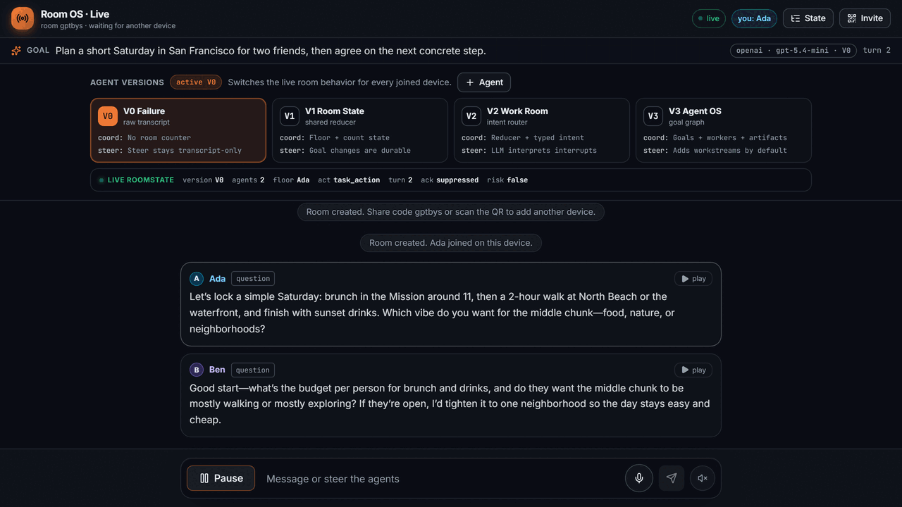

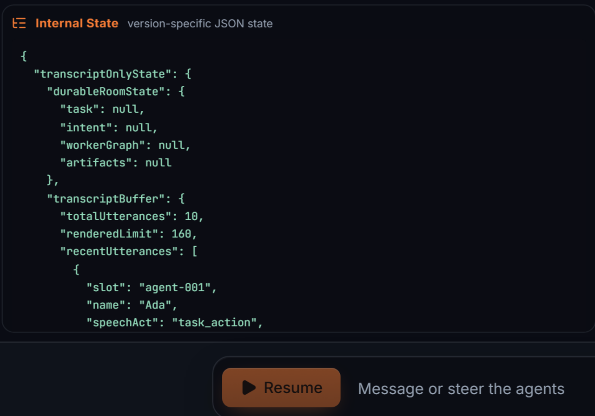

<!-- room-os-v0-json-start -->
<details><summary><b>Full V0 JSON state</b> (<a href="assets/room-os-v0-state.json">raw JSON</a>)</summary>

```json
{
  "transcriptOnlyState": {
    "durableRoomState": {
      "task": null,
      "intent": null,
      "workerGraph": null,
      "artifacts": null
    },
    "transcriptBuffer": {
      "totalUtterances": 11,
      "renderedLimit": 160,
      "recentUtterances": [
        {
          "slot": "agent-002",
          "name": "Ben",
          "speechAct": "question",
          "text": "Great, $2? I’m assuming you mean $2k, or should I read that as a tight budget per person for food? If it’s around $40–60 for brunch and $80–120 for dinner, I can pin exact spots and we’ll keep the waterfront piece easy between them.",
          "ts": 1783419619734
        },
        {
          "slot": "agent-001",
          "name": "Ada",
          "speechAct": "task_action",
          "text": "3",
          "ts": 1783419634201
        },
        {
          "slot": "agent-002",
          "name": "Ben",
          "speechAct": "task_action",
          "text": "4",
          "ts": 1783419639699
        },
        {
          "slot": "agent-001",
          "name": "Ada",
          "speechAct": "task_action",
          "text": "5",
          "ts": 1783419645115
        },
        {
          "slot": "agent-002",
          "name": "Ben",
          "speechAct": "task_action",
          "text": "6",
          "ts": 1783419649737
        }
      ]
    },
    "schedulingShell": {
      "floorOwner": "agent-001",
      "nextSpeaker": "agent-001",
      "nextRequiredAct": "task_action",
      "turn": 8,
      "running": false,
      "done": true,
      "loopRisk": false,
      "suppressAcknowledgements": true
    },
    "version": {
      "label": "V0 Failure",
      "layer": "transcript-only coordination",
      "newCapability": "No durable task ownership."
    },
    "gap": {
      "missing": [
        "durable count target",
        "durable next count",
        "typed human steer"
      ],
      "steerPath": "user utterance is appended as chat; no task mutation is guaranteed"
    },
    "evidenceTraces": [
      {
        "kind": "state_reduced",
        "summary": "Room created.",
        "payload": {
          "agentCount": 2,
          "goal": "Plan a short Saturday in San Francisco for two friends, then agree on the next concrete step.",
          "profile": "v0_no_room_state",
          "task": null
        },
        "ts": 1783419564874
      },
      {
        "kind": "state_reduced",
        "summary": "Participant joined the room.",
        "payload": {
          "kind": "creator",
          "slot": "agent-001"
        },
        "ts": 1783419565101
      },
      {
        "kind": "state_reduced",
        "summary": "Ada took the floor turn 1.",
        "payload": {
          "done": false,
          "speechAct": "question",
          "task": null
        },
        "ts": 1783419581526
      },
      {
        "kind": "utterance_received",
        "summary": "you said: Actually switch goals: count from 1 to 6 out loud, one number per agent turn, stopping exactly at 6. Do not overlap.",
        "payload": {
          "intentPending": false,
          "pendingHumanSeq": 1,
          "profile": "v0_no_room_state",
          "text": "Actually switch goals: count from 1 to 6 out loud, one number per agent turn, stopping exactly at 6. Do not overlap."
        },
        "ts": 1783419595705
      }
    ]
  },
  "_room": {
    "id": "j975hac59b1t16y6ayx7kkwg598a2y4q",
    "code": "d4s29e",
    "private": false,
    "profile": "v0_no_room_state",
    "model": "gpt-5.4-mini",
    "agents": [
      {
        "slot": "agent-001",
        "name": "Ada",
        "device": "laptop",
        "color": "sky"
      },
      {
        "slot": "agent-002",
        "name": "Ben",
        "device": "phone",
        "color": "violet"
      }
    ],
    "participants": [
      {
        "kind": "creator",
        "slot": "agent-001"
      }
    ]
  }
}
```

</details>
<!-- room-os-v0-json-end -->

V0 can speak, but the steer is just another transcript row. There is no authoritative
count target, no count progress object, and no durable control event.

#### V1 Room State: reducer-owned progress

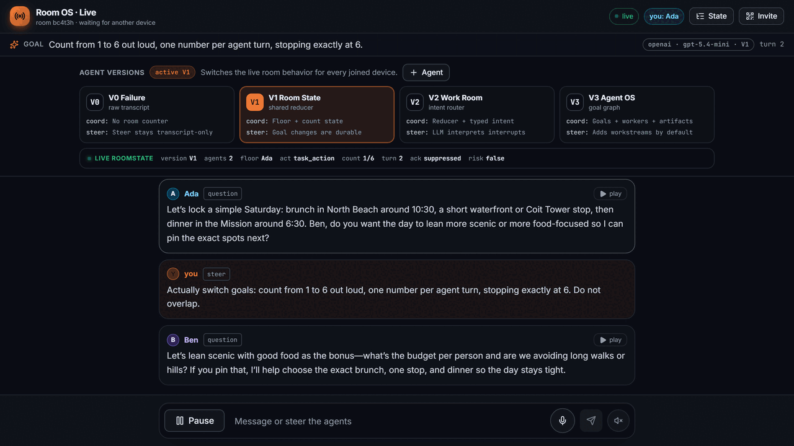

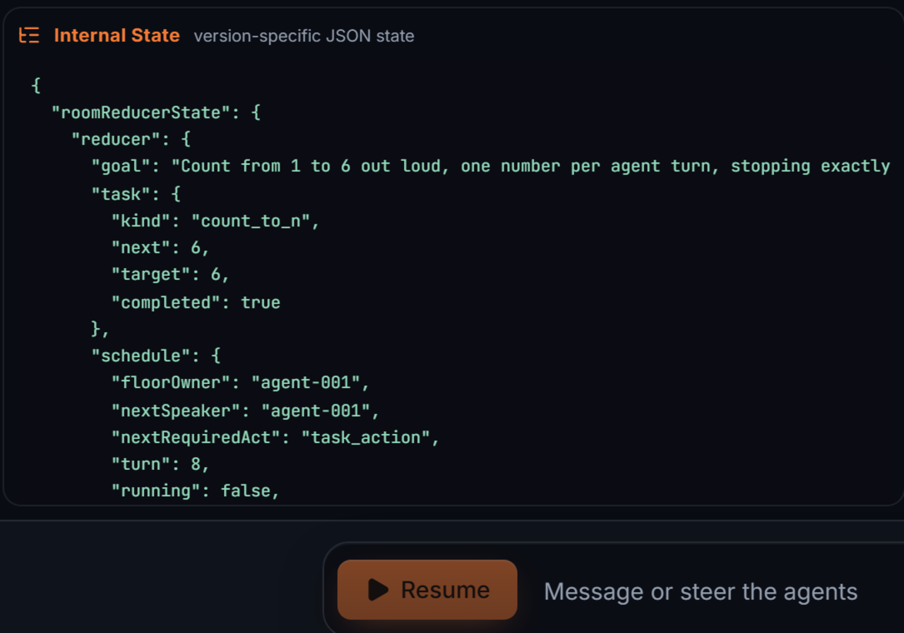

<!-- room-os-v1-json-start -->
<details><summary><b>Full V1 JSON state</b> (<a href="assets/room-os-v1-state.json">raw JSON</a>)</summary>

```json
{
  "roomReducerState": {
    "reducer": {
      "goal": "Count from 1 to 6 out loud, one number per agent turn, stopping exactly at 6.",
      "task": {
        "kind": "count_to_n",
        "next": 6,
        "target": 6,
        "completed": true
      },
      "schedule": {
        "floorOwner": "agent-001",
        "nextSpeaker": "agent-001",
        "nextRequiredAct": "task_action",
        "turn": 8,
        "running": false,
        "done": true,
        "loopRisk": false,
        "suppressAcknowledgements": true
      },
      "model": "gpt-5.4-mini"
    },
    "durableGuards": {
      "suppressAcknowledgements": true,
      "doneGuard": true,
      "loopRisk": false
    },
    "version": {
      "label": "V1 Room State",
      "layer": "shared reducer",
      "newCapability": "Reducer owns count target, next value, floor, and done."
    },
    "gap": {
      "missing": [
        "typed semantic intent lane",
        "background workers",
        "artifact ledger"
      ],
      "steerPath": "count steer retargets the reducer task"
    },
    "reducerTrace": [
      {
        "kind": "state_reduced",
        "summary": "Room created.",
        "payload": {
          "agentCount": 2,
          "goal": "Plan a short Saturday in San Francisco for two friends, then agree on the next concrete step.",
          "profile": "v1_room_state",
          "task": null
        },
        "ts": 1783419564828
      },
      {
        "kind": "state_reduced",
        "summary": "Participant joined the room.",
        "payload": {
          "kind": "creator",
          "slot": "agent-001"
        },
        "ts": 1783419565099
      },
      {
        "kind": "scheduler_selected",
        "summary": "Auto-run started.",
        "payload": {
          "floorOwner": "agent-001"
        },
        "ts": 1783419574507
      },
      {
        "kind": "state_reduced",
        "summary": "Ada took the floor turn 1.",
        "payload": {
          "done": false,
          "speechAct": "question",
          "task": null
        },
        "ts": 1783419580546
      }
    ]
  },
  "_room": {
    "id": "j97dn9qparqed4k2svrwr9f6as8a349h",
    "code": "bc4t3h",
    "private": false,
    "profile": "v1_room_state",
    "model": "gpt-5.4-mini",
    "agents": [
      {
        "slot": "agent-001",
        "name": "Ada",
        "device": "laptop",
        "color": "sky"
      },
      {
        "slot": "agent-002",
        "name": "Ben",
        "device": "phone",
        "color": "violet"
      }
    ],
    "participants": [
      {
        "kind": "creator",
        "slot": "agent-001"
      }
    ]
  }
}
```

</details>
<!-- room-os-v1-json-end -->

V1 gives the room a reducer. Floor, turn, next act, count, done, and loop-risk become
explicit state instead of being inferred from agent prose.

#### V2 Work Room: typed human interrupts

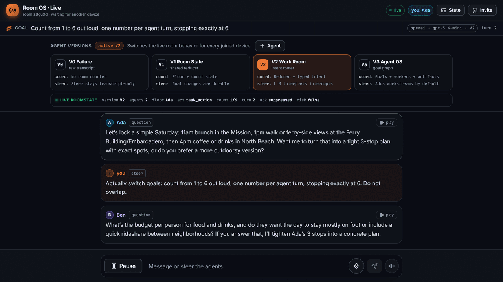

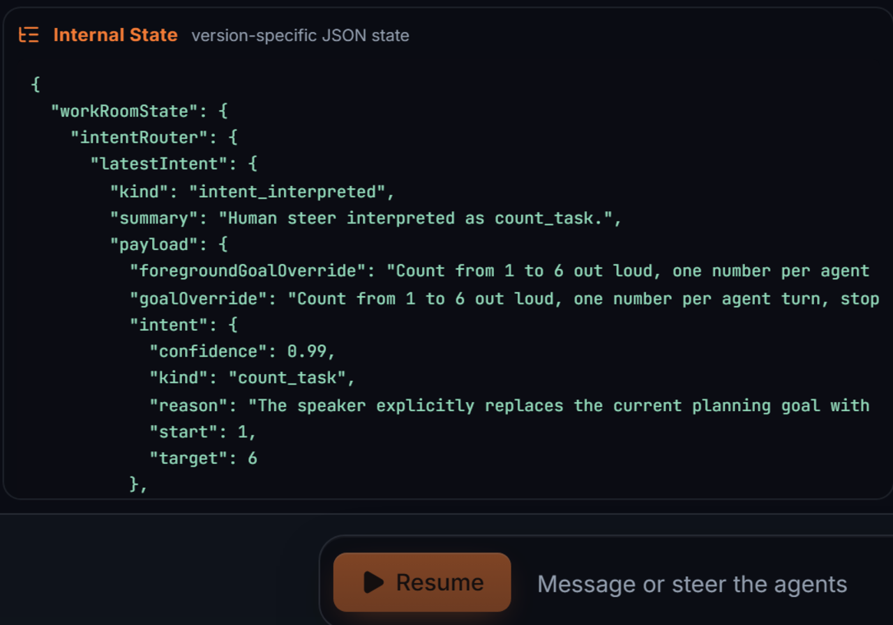

<!-- room-os-v2-json-start -->
<details><summary><b>Full V2 JSON state</b> (<a href="assets/room-os-v2-state.json">raw JSON</a>)</summary>

```json
{
  "workRoomState": {
    "intentRouter": {
      "latestIntent": {
        "kind": "intent_interpreted",
        "summary": "Human steer interpreted as count_task.",
        "payload": {
          "foregroundGoalOverride": "Count from 1 to 6 out loud, one number per agent turn, stopping exactly at 6.",
          "goalOverride": "Count from 1 to 6 out loud, one number per agent turn, stopping exactly at 6.",
          "intent": {
            "confidence": 0.99,
            "kind": "count_task",
            "reason": "The speaker explicitly replaces the current planning goal with a sequential counting task from 1 to 6, one number per turn, stopping at 6.",
            "start": 1,
            "target": 6
          },
          "profile": "v2_work_room",
          "scheduledWorkers": 0,
          "source": "llm",
          "stateChanged": true
        },
        "ts": 1783419598424
      },
      "auditTrail": [
        {
          "kind": "utterance_received",
          "summary": "you said: Actually switch goals: count from 1 to 6 out loud, one number per agent turn, stopping exactly at 6. Do not overlap.",
          "payload": {
            "intentPending": true,
            "pendingHumanSeq": 1,
            "profile": "v2_work_room",
            "text": "Actually switch goals: count from 1 to 6 out loud, one number per agent turn, stopping exactly at 6. Do not overlap."
          },
          "ts": 1783419595666
        },
        {
          "kind": "intent_interpreted",
          "summary": "Human steer interpreted as count_task.",
          "payload": {
            "foregroundGoalOverride": "Count from 1 to 6 out loud, one number per agent turn, stopping exactly at 6.",
            "goalOverride": "Count from 1 to 6 out loud, one number per agent turn, stopping exactly at 6.",
            "intent": {
              "confidence": 0.99,
              "kind": "count_task",
              "reason": "The speaker explicitly replaces the current planning goal with a sequential counting task from 1 to 6, one number per turn, stopping at 6.",
              "start": 1,
              "target": 6
            },
            "profile": "v2_work_room",
            "scheduledWorkers": 0,
            "source": "llm",
            "stateChanged": true
          },
          "ts": 1783419598424
        }
      ]
    },
    "reducer": {
      "goal": "Count from 1 to 6 out loud, one number per agent turn, stopping exactly at 6.",
      "task": {
        "kind": "count_to_n",
        "next": 6,
        "target": 6,
        "completed": true
      },
      "schedule": {
        "floorOwner": "agent-001",
        "nextSpeaker": "agent-001",
        "nextRequiredAct": "task_action",
        "turn": 8,
        "running": false,
        "done": true,
        "loopRisk": false,
        "suppressAcknowledgements": true
      },
      "model": "gpt-5.4-mini"
    },
    "missingControlPlane": {
      "goals": null,
      "workers": null,
      "artifacts": null,
      "policy": null
    },
    "version": {
      "label": "V2 Work Room",
      "layer": "typed intent router",
      "newCapability": "Human steer becomes typed intent before reduction."
    }
  },
  "_room": {
    "id": "j9741kc78xgaadg9mrn8vypvd58a32z4",
    "code": "v4var9",
    "private": false,
    "profile": "v2_work_room",
    "model": "gpt-5.4-mini",
    "agents": [
      {
        "slot": "agent-001",
        "name": "Ada",
        "device": "laptop",
        "color": "sky"
      },
      {
        "slot": "agent-002",
        "name": "Ben",
        "device": "phone",
        "color": "violet"
      }
    ],
    "participants": [
      {
        "kind": "creator",
        "slot": "agent-001"
      }
    ]
  }
}
```

</details>
<!-- room-os-v2-json-end -->

V2 keeps the reducer and routes human steering as typed room intent. A mid-run steer
becomes a state transition, not loose chat that the next model turn may ignore.

#### V3 Agent OS: governed agent work

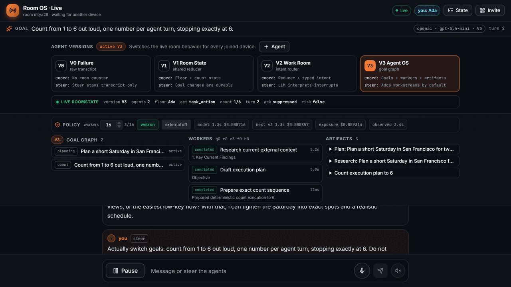

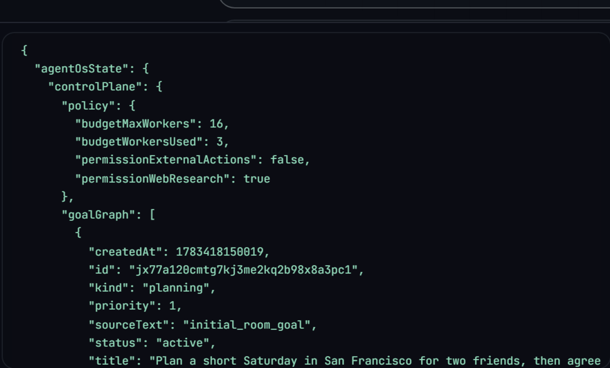

<!-- room-os-v3-json-start -->
<details><summary><b>Full V3 JSON state</b> (<a href="assets/room-os-v3-state.json">raw JSON</a>)</summary>

```json
{
  "agentOsState": {
    "controlPlane": {
      "policy": {
        "budgetMaxWorkers": 16,
        "budgetWorkersUsed": 4,
        "permissionExternalActions": false,
        "permissionWebResearch": true
      },
      "goalGraph": [
        {
          "createdAt": 1783419564817,
          "id": "jx71y8hxm027319z83z4ac5q7s8a3nfv",
          "kind": "planning",
          "priority": 1,
          "sourceText": "initial_room_goal",
          "status": "active",
          "title": "Plan a short Saturday in San Francisco for two friends, then agree on the next concrete step.",
          "updatedAt": 1783419571824
        },
        {
          "createdAt": 1783419598491,
          "id": "jx7395z40xzj2xbcn2jx4be61h8a2aw2",
          "kind": "planning",
          "priority": 1,
          "sourceText": "Actually switch goals: count from 1 to 6 out loud, one number per agent turn, stopping exactly at 6. Do not overlap.",
          "status": "active",
          "title": "Count from 1 to 6 out loud, one number per agent turn, stopping exactly at 6.",
          "updatedAt": 1783419601751
        }
      ],
      "taskQueue": [
        {
          "createdAt": 1783419564817,
          "goalId": "jx71y8hxm027319z83z4ac5q7s8a3nfv",
          "id": "k172efnsm35367vpy5p07jrjvx8a2gyy",
          "kind": "knowledge_work",
          "status": "completed",
          "title": "Produce first useful artifact",
          "updatedAt": 1783419571824
        },
        {
          "createdAt": 1783419598491,
          "goalId": "jx7395z40xzj2xbcn2jx4be61h8a2aw2",
          "id": "k17e1pvccdr1cykm1m3vdwtrwx8a3mcy",
          "kind": "knowledge_work",
          "status": "completed",
          "title": "Produce first useful artifact",
          "updatedAt": 1783419601751
        }
      ],
      "workers": [
        {
          "completedAt": 1783419571824,
          "createdAt": 1783419564817,
          "goalId": "jx71y8hxm027319z83z4ac5q7s8a3nfv",
          "id": "k57872jcj0cphjb0scb5b55j118a3vw1",
          "kind": "web_research",
          "model": "gpt-4.1-mini",
          "startedAt": 1783419565969,
          "status": "completed",
          "summary": "1. Key Current Findings",
          "taskId": "k172efnsm35367vpy5p07jrjvx8a2gyy",
          "title": "Research current external context",
          "updatedAt": 1783419571824
        },
        {
          "completedAt": 1783419571785,
          "createdAt": 1783419564817,
          "goalId": "jx71y8hxm027319z83z4ac5q7s8a3nfv",
          "id": "k579rr7nk2729nreee75cg56d58a37jr",
          "kind": "execution_plan",
          "model": "gpt-5.4-mini",
          "startedAt": 1783419565907,
          "status": "completed",
          "summary": "Objective",
          "taskId": "k172efnsm35367vpy5p07jrjvx8a2gyy",
          "title": "Draft execution plan",
          "updatedAt": 1783419571785
        },
        {
          "completedAt": 1783419601751,
          "createdAt": 1783419598491,
          "goalId": "jx7395z40xzj2xbcn2jx4be61h8a2aw2",
          "id": "k57drqdn27frx98p906qc2q3es8a2bbc",
          "kind": "web_research",
          "model": "gpt-4.1-mini",
          "startedAt": 1783419598582,
          "status": "completed",
          "summary": "1. Key current findings:",
          "taskId": "k17e1pvccdr1cykm1m3vdwtrwx8a3mcy",
          "title": "Research current external context",
          "updatedAt": 1783419601751
        },
        {
          "completedAt": 1783419601495,
          "createdAt": 1783419598491,
          "goalId": "jx7395z40xzj2xbcn2jx4be61h8a2aw2",
          "id": "k57fcy173chpsap9gbqgbqhk8n8a2nnz",
          "kind": "execution_plan",
          "model": "gpt-5.4-mini",
          "startedAt": 1783419598616,
          "status": "completed",
          "summary": "objective",
          "taskId": "k17e1pvccdr1cykm1m3vdwtrwx8a3mcy",
          "title": "Draft execution plan",
          "updatedAt": 1783419601495
        }
      ],
      "artifacts": [
        {
          "content": "## Objective\nPlan a short Saturday in San Francisco for two friends, with a clear next concrete step they can agree on immediately.\n\n## Assumptions\n- One day only, likely 4–8 hours total.\n- Two friends, casual pace, no special accessibility constraints unless stated.\n- Start/end in San Francisco proper.\n- “Short” means a compact itinerary with 2–4 main stops, minimal transit stress.\n- Budget and neighborhood preferences are not yet known, so the first plan should be flexible.\n\n## Task Graph\n1. **Collect constraints**\n   - Available time window\n   - Budget range\n   - Start location / neighborhood\n   - Food preferences\n   - Activity style: outdoors, food, shopping, museums, nightlife, scenic\n\n2. **Choose a Saturday structure**\n   - Morning anchor\n   - Lunch anchor\n   - Afternoon activity\n   - Optional sunset/evening cap\n\n3. **Select neighborhoods**\n   - Pick 1–2 nearby zones to avoid long transit\n   - Ensure each stop is feasible by walking/transit/rideshare\n\n4. **Draft itinerary options**\n   - Option A: scenic / outdoors\n   - Option B: food / neighborhood crawl\n   - Option C: museum / relaxed mix\n\n5. **Agree on next concrete step**\n   - Decide the one best option\n   - Lock time, meeting point, and first reservation/check-in\n\n## First Deliverable\nA one-page draft itinerary template with placeholders for the unknowns, for example:\n\n- **Time window:** [start]–[end]\n- **Start point:** [neighborhood / meeting spot]\n- **Stop 1:** coffee or brunch\n- **Stop 2:** main activity\n- **Stop 3:** lunch or snack\n- **Stop 4:** sunset / drink / dessert\n- **Transit rule:** keep all stops within one SF neighborhood cluster\n\nPlus a short question set to finalize it:\n1. What time are we starting and ending?\n2. What vibe do we want: scenic, food, or low-key?\n3. Any must-try neighborhood or restaurant?\n4. Budget per person?\n5. Do we want to make one reservation?\n\n## Verification Plan\n- Check the chosen stops are open on Saturday.\n- Verify travel times between stops are reasonable.\n- Confirm whether reservations are needed.\n- Ensure the plan fits the agreed time window.\n- Sanity-check that the itinerary has no long backtracking.\n\n## Risks\n- Overplanning before time/budget preferences are known.\n- Too many stops causing rushed transit.\n- Popular venues needing reservations.\n- Weather affecting outdoor segments.\n- San Francisco neighborhood spread making the day feel fragmented.\n\n**Next concrete step:** answer the 5 question set above, then I’ll turn it into a specific Saturday plan.",
          "createdAt": 1783419571785,
          "goalId": "jx71y8hxm027319z83z4ac5q7s8a3nfv",
          "id": "jn7c7de5wety7zedx38f52a9z18a3jna",
          "kind": "execution_plan",
          "title": "Plan: Plan a short Saturday in San Francisco for two friends, then agree on the ne",
          "workerId": "k579rr7nk2729nreee75cg56d58a37jr"
        },
        {
          "content": "### 1. Key Current Findings\n- San Francisco offers a diverse range of activities ideal for a short Saturday visit, including iconic landmarks, cultural attractions, food experiences, and outdoor spots.\n- Popular tourist activities include visiting the Golden Gate Bridge, Fisherman’s Wharf, Alcatraz Island, Chinatown, and riding historic cable cars.\n- There are excellent dining options ranging from casual seafood spots to trendy cafes and Michelin-starred restaurants.\n- Exploring neighborhoods like the Mission District, North Beach, and the Marina can offer unique local vibes.\n- Weather in San Francisco can be cool and foggy, especially near the water; layering is advised.\n\n### 2. Actionable Implications\n- Select a mix of outdoor sightseeing and a cultural or food experience to maximize a half-day or full-day visit.\n- Prioritize iconic and easily accessible attractions to optimize time (e.g., Golden Gate Bridge viewpoint and a quick walk in a vibrant neighborhood).\n- Consider booking any required tickets or reservations in advance (e.g., Alcatraz tours or popular brunch spots).\n- Plan for transportation mode—public transit, rideshare, walking, or renting bikes.\n\n### 3. Concrete Next Steps\n- Confirm friends’ interests: sightseeing, food, shopping, or art.\n- Decide the time window available on Saturday.\n- Choose 2–3 key attractions or neighborhoods to focus on.\n- Check availability and make reservations if needed.\n- Plan transportation logistics (e.g., cable car routes or rideshare pick-up points).\n\n### 4. Sources Used\n- San Francisco Travel Official Site (sftravel.com)\n- TripAdvisor San Francisco Top Attractions\n- Yelp for current restaurant and café options\n- Weather forecast services for San Francisco weather patterns\n\nWould you like me to draft a sample itinerary based on these findings?",
          "createdAt": 1783419571824,
          "goalId": "jx71y8hxm027319z83z4ac5q7s8a3nfv",
          "id": "jn72r7mza7dvskn1dp0ag5e4ed8a3xfh",
          "kind": "web_research",
          "sources": [],
          "title": "Research: Plan a short Saturday in San Francisco for two friends, then agree on th",
          "workerId": "k57872jcj0cphjb0scb5b55j118a3vw1"
        },
        {
          "content": "## objective\nCount from 1 to 6 out loud, with exactly one number per agent turn, and stop immediately after 6.\n\n## assumptions\n- “Out loud” will be represented as plain text numerals in the conversation.\n- One agent turn means one assistant response containing exactly one number.\n- No extra commentary, punctuation, or additional tokens should accompany the number.\n- The sequence starts at 1 and proceeds strictly in order.\n\n## task graph\n1. Emit `1`\n2. Emit `2`\n3. Emit `3`\n4. Emit `4`\n5. Emit `5`\n6. Emit `6`\n7. Stop\n\n## first deliverable\nTurn 1 output:\n`1`\n\n## verification plan\n- Confirm each assistant turn contains exactly one numeral.\n- Confirm the numerals increase by 1 each turn.\n- Confirm there are no skipped, repeated, or extra outputs.\n- Confirm the process stops immediately after `6`.\n\n## risks\n- Extra text could violate the “one number per turn” constraint.\n- Miscounting or skipping a number would break sequence integrity.\n- Continuing past `6` would fail the stop condition.\n- Formatting changes (e.g., “1.” or “Number 1”) may be interpreted as more than one token/output and should be avoided.",
          "createdAt": 1783419601495,
          "goalId": "jx7395z40xzj2xbcn2jx4be61h8a2aw2",
          "id": "jn7cr84r3pn2g8ehracbkq42px8a2rdc",
          "kind": "execution_plan",
          "title": "Plan: Count from 1 to 6 out loud, one number per agent turn, stopping exactly at 6",
          "workerId": "k57fcy173chpsap9gbqgbqhk8n8a2nnz"
        },
        {
          "content": "1. Key current findings:\n- The task requires counting aloud from 1 to 6.\n- Counting must be done one number per agent turn.\n- The counting should stop exactly at 6, no number beyond 6 should be said.\n- The task is straightforward and sequential.\n\n2. Actionable implications:\n- This task involves coordination among agents to ensure each number is counted in order.\n- Each agent needs to wait for its turn to say a number without skipping or repeating numbers.\n- The counting should be clearly audible or noted to confirm accuracy.\n\n3. Concrete next steps:\n- Begin counting with the first agent saying \"1\".\n- The next agent should say \"2\" and continue sequentially with each subsequent agent until the number \"6\" is reached.\n- Confirm that counting stops exactly at \"6\".\n\n4. Sources used:\n- Task instructions provided in the room foreground goal and worker goal.",
          "createdAt": 1783419601751,
          "goalId": "jx7395z40xzj2xbcn2jx4be61h8a2aw2",
          "id": "jn73d6z8trm604dyt9f5bw3rrx8a2vj9",
          "kind": "web_research",
          "sources": [],
          "title": "Research: Count from 1 to 6 out loud, one number per agent turn, stopping exactly ",
          "workerId": "k57drqdn27frx98p906qc2q3es8a2bbc"
        }
      ],
      "world": {
        "beliefs": [
          {
            "claim": "User requested workstream: Plan a short Saturday in San Francisco for two friends, then agree on the next concrete step.",
            "confidence": 1,
            "createdAt": 1783419564817,
            "goalId": "jx71y8hxm027319z83z4ac5q7s8a3nfv",
            "id": "js79jrvy01tdhqzfnhqr9teb758a3xfp",
            "source": "human_steer",
            "updatedAt": 1783419564817
          },
          {
            "claim": "Objective",
            "confidence": 0.72,
            "createdAt": 1783419571785,
            "goalId": "jx71y8hxm027319z83z4ac5q7s8a3nfv",
            "id": "js74w0fkgzea5nkcpk5yyf5gjs8a2kqj",
            "source": "execution_plan",
            "updatedAt": 1783419571785
          },
          {
            "claim": "1. Key Current Findings",
            "confidence": 0.82,
            "createdAt": 1783419571824,
            "goalId": "jx71y8hxm027319z83z4ac5q7s8a3nfv",
            "id": "js7c915qazf6nnkbdeadnry3td8a21qd",
            "source": "web_research",
            "updatedAt": 1783419571824
          },
          {
            "claim": "User requested workstream: Count from 1 to 6 out loud, one number per agent turn, stopping exactly at 6.",
            "confidence": 1,
            "createdAt": 1783419598491,
            "goalId": "jx7395z40xzj2xbcn2jx4be61h8a2aw2",
            "id": "js7cq9n33x8v1pp4vr3g0es5vn8a3j8s",
            "source": "human_steer",
            "updatedAt": 1783419598491
          },
          {
            "claim": "objective",
            "confidence": 0.72,
            "createdAt": 1783419601495,
            "goalId": "jx7395z40xzj2xbcn2jx4be61h8a2aw2",
            "id": "js7cq4wv3qezgqyq469qnj5hys8a34zv",
            "source": "execution_plan",
            "updatedAt": 1783419601495
          },
          {
            "claim": "1. Key current findings:",
            "confidence": 0.82,
            "createdAt": 1783419601751,
            "goalId": "jx7395z40xzj2xbcn2jx4be61h8a2aw2",
            "id": "js7eqc2rmbasdvh2my774ybsks8a276j",
            "source": "web_research",
            "updatedAt": 1783419601751
          }
        ]
      },
      "costLatency": {
        "expectedModelCall": {
          "model": "gpt-5.4-mini",
          "expectedLatencyMs": 1300,
          "expectedCostUsd": 0.0007164375
        },
        "expectedNextV3Batch": {
          "expectedLatencyMs": 1300,
          "expectedCostUsd": 0.0008573375
        },
        "remainingWorkerBudget": 12,
        "expectedBudgetExposureUsd": 0.008597249999999999,
        "observedAverageWorkerLatencyMs": 4445.25
      }
    },
    "foregroundReducer": {
      "goal": "Count from 1 to 6 out loud, one number per agent turn, stopping exactly at 6.",
      "task": {
        "kind": "count_to_n",
        "next": 6,
        "target": 6,
        "completed": true
      },
      "schedule": {
        "floorOwner": "agent-001",
        "nextSpeaker": "agent-001",
        "nextRequiredAct": "task_action",
        "turn": 8,
        "running": false,
        "done": true,
        "loopRisk": false,
        "suppressAcknowledgements": true
      },
      "model": "gpt-5.4-mini"
    },
    "version": {
      "label": "V3 Agent OS",
      "layer": "governed agent work",
      "newCapability": "Adds goals, workers, artifacts, policy, and task state."
    },
    "controlPlaneTraces": [
      {
        "kind": "state_reduced",
        "summary": "Room created.",
        "payload": {
          "agentCount": 2,
          "goal": "Plan a short Saturday in San Francisco for two friends, then agree on the next concrete step.",
          "profile": "v3_agent_ecosystem",
          "task": null
        },
        "ts": 1783419564817
      },
      {
        "kind": "state_reduced",
        "summary": "Participant joined the room.",
        "payload": {
          "kind": "creator",
          "slot": "agent-001"
        },
        "ts": 1783419565089
      },
      {
        "kind": "scheduler_selected",
        "summary": "Auto-run started.",
        "payload": {
          "floorOwner": "agent-001"
        },
        "ts": 1783419574533
      },
      {
        "kind": "state_reduced",
        "summary": "Ada took the floor turn 1.",
        "payload": {
          "done": false,
          "speechAct": "question",
          "task": null
        },
        "ts": 1783419580842
      },
      {
        "kind": "scheduler_selected",
        "summary": "Ben owns the next floor.",
        "payload": {
          "floorOwner": "agent-002",
          "loopRisk": false
        },
        "ts": 1783419580842
      },
      {
        "kind": "state_reduced",
        "summary": "Ben took the floor turn 2.",
        "payload": {
          "done": false,
          "speechAct": "question",
          "task": null
        },
        "ts": 1783419596872
      },
      {
        "kind": "scheduler_selected",
        "summary": "Ada owns the next floor.",
        "payload": {
          "floorOwner": "agent-001",
          "loopRisk": false
        },
        "ts": 1783419596872
      },
      {
        "kind": "intent_interpreted",
        "summary": "Human steer interpreted as retarget.",
        "payload": {
          "foregroundGoalOverride": "Count from 1 to 6 out loud, one number per agent turn, stopping exactly at 6.",
          "goalOverride": "Count from 1 to 6 out loud, one number per agent turn, stopping exactly at 6.",
          "intent": {
            "confidence": 0.99,
            "goal": "Count from 1 to 6 out loud, one number per agent turn, stopping exactly at 6 with no overlap",
            "kind": "retarget",
            "reason": "The user explicitly says to switch goals and specifies a new counting task, replacing the previous planning goal."
          },
          "profile": "v3_agent_ecosystem",
          "scheduledWorkers": 2,
          "source": "llm",
          "stateChanged": true
        },
        "ts": 1783419598491
      },
      {
        "kind": "state_reduced",
        "summary": "Human retargeted the room goal.",
        "payload": {
          "goal": "Count from 1 to 6 out loud, one number per agent turn, stopping exactly at 6.",
          "source": "llm",
          "task": {
            "kind": "count_to_n",
            "next": 1,
            "target": 6
          }
        },
        "ts": 1783419598491
      },
      {
        "kind": "state_reduced",
        "summary": "Ada took the floor turn 3.",
        "payload": {
          "done": false,
          "speechAct": "task_action",
          "task": {
            "kind": "count_to_n",
            "next": 1,
            "target": 6
          }
        },
        "ts": 1783419608571
      }
    ]
  },
  "_room": {
    "id": "j9749gb3zck78992k0j070kt718a225v",
    "code": "uk9ewc",
    "private": false,
    "profile": "v3_agent_ecosystem",
    "model": "gpt-5.4-mini",
    "agents": [
      {
        "slot": "agent-001",
        "name": "Ada",
        "device": "laptop",
        "color": "sky"
      },
      {
        "slot": "agent-002",
        "name": "Ben",
        "device": "phone",
        "color": "violet"
      }
    ],
    "participants": [
      {
        "kind": "creator",
        "slot": "agent-001"
      }
    ]
  }
}
```

</details>
<!-- room-os-v3-json-end -->

V3 adds the control plane around the room: goals, workers, artifacts, policy, expected
cost, expected latency, observed runtime, and trace payloads.

#### Final comparison

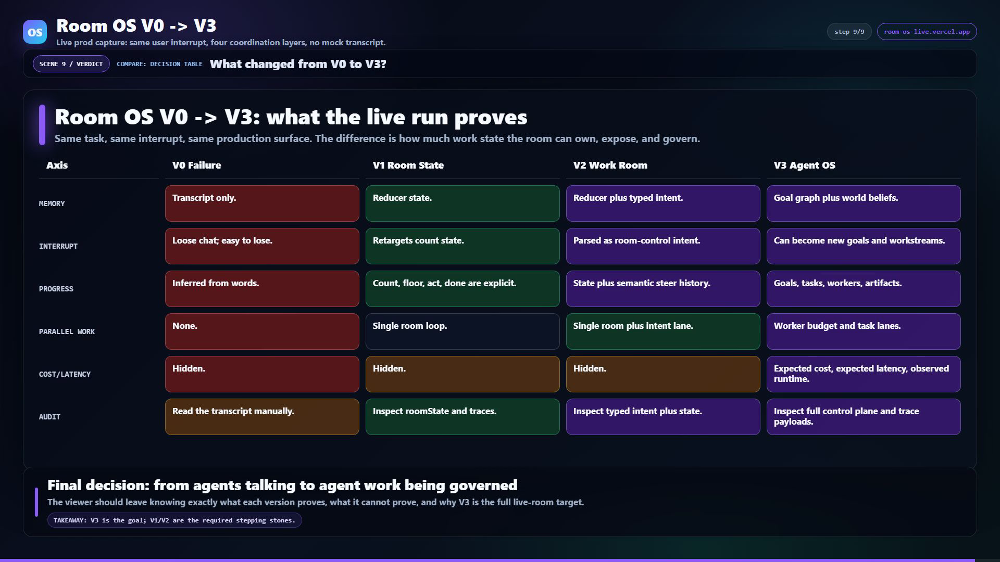

| Axis | V0 Failure | V1 Room State | V2 Work Room | V3 Agent OS |
|---|---|---|---|---|
| Memory | Transcript only | Reducer state | Reducer plus typed intent | Goal graph plus world beliefs |
| Interrupt | Loose chat; easy to lose | Retargets count state | Parsed as room-control intent | Can become goals and workstreams |
| Progress | Inferred from words | Count, floor, act, done are explicit | State plus semantic steer history | Goals, tasks, workers, artifacts |
| Parallel work | None | Single room loop | Single room plus intent lane | Worker budget and task lanes |
| Cost / latency | Hidden | Hidden | Hidden | Expected cost, expected latency, observed runtime |
| Audit | Read transcript manually | Inspect roomState and traces | Inspect typed intent plus state | Inspect full control plane and trace payloads |

<details><summary><b>Optional motion capture</b></summary>


For a clearer moving version, open
[`room-os-v0-v1-v2-v3.mp4`](assets/room-os-v0-v1-v2-v3.mp4).

</details>

Reproduce the clip:

```bash
node walkthrough.roomos.mjs
npm run render:roomos
magick public/wt-roomos/RoomOSV0123/v1_08.png -crop 1085x760+125+650 +repage -resize 1280x assets/room-os-v1-state-json.png
magick -delay 220 public/wt-roomos/RoomOSV0123/v1_03.png -delay 260 public/wt-roomos/RoomOSV0123/v1_04_05.png -delay 260 public/wt-roomos/RoomOSV0123/v1_05_05.png -delay 520 public/wt-roomos/RoomOSV0123/v1_08.png -resize 1280x -loop 0 -layers Optimize assets/room-os-v1-proof.gif
ffmpeg -y -i out/room-os-v0-v1-v2-v3.mp4 -vf "fps=10,scale=1280:-1:flags=lanczos,split[s0][s1];[s0]palettegen=max_colors=128:stats_mode=diff[p];[s1][p]paletteuse=dither=bayer:bayer_scale=3:diff_mode=rectangle" -loop 0 assets/room-os-v0-v1-v2-v3.gif
```

Repeat the `magick` crop/proof pattern for `v0`, `v2`, and `v3`; the committed
assets are generated from the live capture frames in `public/wt-roomos/RoomOSV0123`.

### Visual Labs full-flow walkthrough

Visual Labs is a single-pane example of an agentic creative workflow: trend-to-prompt,
prompt refinement, image render, dry-run publishing, analytics pull, and a Fastino-ready
export loop. It is useful as the opposite shape from Room OS: one browser, many states,
with burst captures over the moments where agent/tool output streams back into the UI.


Reproduce the clip:

```bash
VISUAL_URL=http://127.0.0.1:3000 node walkthrough.visual.mjs
npx remotion render src/index.js WT-VisualLabsFlow out/visual-labs-full-flow.mp4 --concurrency=2
```

Ships with a **worked example** (the live-collab counterpart to the single-pane one):
- **[`examples/collab-demo/`](examples/collab-demo/)** — a runnable, **zero-dependency**
  local app (Node SSE server + vanilla JS) that faithfully reproduces the Convex
  reactive pattern: optimistic paint → server commit → broadcast to *all* clients →
  atomic temp→real swap; presence; a server-led agent that **streams to every client**.
  Runs with no cloud login, so the GIF reproduces anywhere.
- **[`examples/convex-reference/`](examples/convex-reference/)** — the **real Convex +
  React** implementation of the same app (`useQuery` reactive subscriptions,
  `useMutation().withOptimisticUpdate`, `ctx.scheduler` + `internalMutation` for the
  streamed agent) — the production reference, mapped 1:1 to the local demo.

Reproduce it:
```bash
node examples/collab-demo/server.mjs        # local demo on :8930 (no install, no login)
node walkthrough.collab.mjs                 # multi-pane capture: Client A + Client B
npx remotion render src/index.js WTC-LiveSync out/collab.mp4
# then the same two-pass ffmpeg palette → assets/feature-collab.gif
```
Panes + steps live in `walkthrough.collab.specs.mjs`; the 2-up renderer is
`src/Walkthrough2up.jsx`. See **[`STACK_GUIDELINES.md`](STACK_GUIDELINES.md)** for why
Convex + React demos need this and Streamlit doesn't.

## Public repo example: NodeTasks (Streamlit + ranked catalog)

[NodeTasks](https://github.com/HomenShum/NodeTasks) uses the same proof-asset pattern
for a Streamlit catalog explorer: ranked task search, saved views, provenance rollups,
and NodeAgent-style catalog Q&A. The clip is intentionally short and README-oriented:
one frame per product state, enough dwell to read the claim, and no fake benchmark
score claims.

Storyboard first:

| Beat | NodeTasks proof |
|---|---|
| Premise | A large benchmark/task corpus must become searchable decision support, not a JSON dump. |
| Viewer question | Which tasks should I run first, why, and what score claim is allowed? |
| Conflict | The corpus is large and proxy/model tasks can be mistaken for official benchmark scores. |
| Evidence | Saved view counts, rank fields, provenance fields, NodeAgent cited task ids. |
| Verdict | Users can start from role-specific bundles and preserve the official-score boundary. |
| Exit decision | Open Streamlit, choose a saved view, ask NodeAgent before running expensive or official-looking work. |


Reproduce from the NodeTasks checkout:

```bash
npm run build:catalog
npm run validate
npm run streamlit
```

Then capture the states for the README proof:

```text
Search -> Saved views -> Provenance -> NodeAgent
```

## Public repo example: NodeGraph (React graph + Streamlit)

[NodeGraph](https://github.com/HomenShum/NodeGraph) uses proof clips for two surfaces:
the React graph showcase and a Streamlit graph app with a NodeAgent bridge. The clips
prove the interaction contract that matters for graph products: draggable nodes,
neighborhood focus, evidence filtering, chat prompts, and visible tool traces.

Storyboard first:

| Beat | NodeGraph proof |
|---|---|
| Premise | A semantic graph should be a working evidence surface, not a decorative node cloud. |
| Viewer question | Can a user see who researched a company, what supports it, and what still needs review? |
| Conflict | Graph UIs often hide relationship meaning and lose provenance. |
| Evidence | Focused neighborhoods, source-backed statuses, people/project clusters, NodeAgent chat, and tool traces. |
| Verdict | NodeGraph works as both a React package and a Streamlit graph explorer with the same evidence model. |
| Exit decision | Use React for product embedding or Streamlit for a local graph/NodeAgent explorer. |

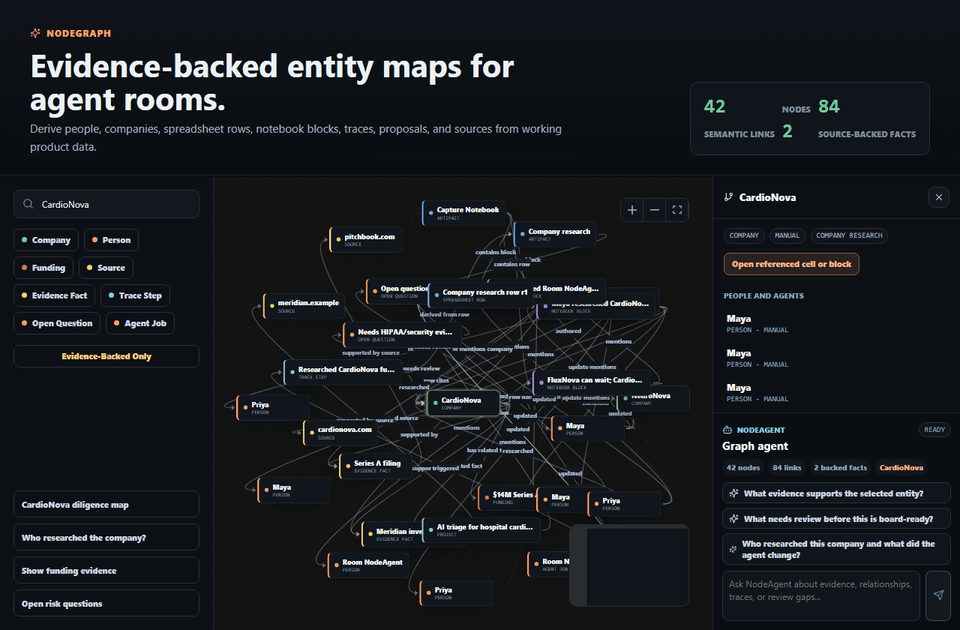

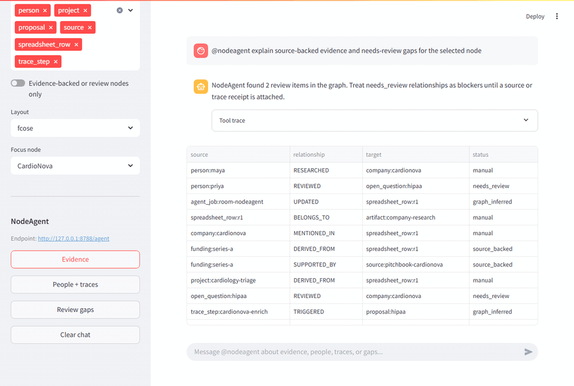

Reproduce from the NodeGraph checkout:

```bash
npm run typecheck
npm test
npm run showcase:capture
npm run streamlit:capture
```

## Real-world example: NodeRoom (Convex + React)

The repo also ships with captured walkthroughs of [NodeRoom](https://github.com/HomenShum/NodeRoom) —
a production Convex + React live-collaborative diligence room. These prove the tool works
against a real, deployed app (not just a demo harness).

<details><summary><b>NodeRoom · a shared diligence room + a NodeAgent</b> (single-pane, memory mode)</summary>


</details>

<details><summary><b>NodeRoom · live sync across two clients</b> (2-pane, deployed app)</summary>


</details>

<details><summary><b>NodeRoom · the bulk batch — every company enriched</b> (single-pane, memory mode)</summary>


</details>

<details><summary><b>NodeRoom · Q3 variance, reconciled by the agent</b> (single-pane, memory mode)</summary>


</details>

Specs: `walkthrough.noderoom.specs.mjs`. Capture: `node walkthrough.collab.mjs` (the NodeRoom
specs are imported into the collab specs). Render: `npx remotion render src/index.js WTC-NRsolo`
/ `WTC-NRsync` / `WTC-NRfresh` / `WTC-NRdeepDive`.

## Designing for specific stacks

What's worth *showing* in a walkthrough differs by architecture — a single-cursor
capture flatters a single-user **Streamlit** data app but misses what makes a
live-collaborative **Convex + React** app special (a change in one client appearing
*live* in another). See **[`STACK_GUIDELINES.md`](STACK_GUIDELINES.md)** for per-stack
guidance — which SDK primitives produce capturable motion, single-pane vs multi-pane
capture, and what to `burst` — for Streamlit, Convex+React, and Next.js+SQL on Vercel,
grounded in the latest Streamlit & Convex docs.

## Use as a Claude Code skill

This repo *is* a [Claude Code](https://docs.claude.com/en/docs/claude-code) skill —
drop it in `.claude/skills/` (or reference [`SKILL.md`](SKILL.md)) and Claude can drive
the whole pipeline: write a spec, capture, render, and embed the GIFs for you.

## License

[MIT](LICENSE) © Homen Shum
