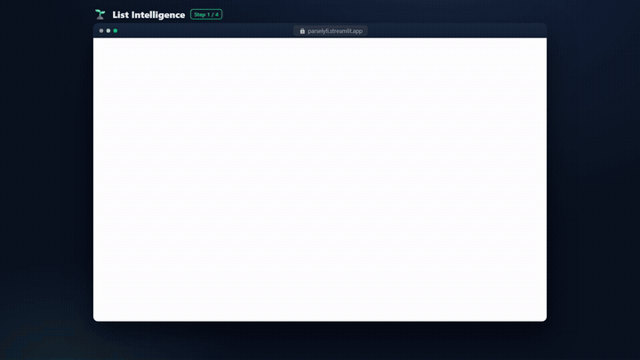

<div align="center">

# 🎬 feature-walkthrough-gif

### Turn any web feature into a polished, **annotated walkthrough GIF**.

Every UI state · an animated cursor that **glides to each click** (with a ripple) · a **zoom‑to‑focus camera** · the **loading/streaming captured live** (spinner spinning, results coming in) · step captions · a progress bar.
Not a single final‑state "hero shot" — the viewer follows the *whole flow*.

[](LICENSE)




<sub>↑ produced by this tool — every state, the click, the loading, the result.</sub>

</div>

---

## Why

Most README/demo GIFs are **hero shots** — they show the *final* screen, so a viewer
can't tell *where the user clicked*, what the empty state looked like, or how the
result was reached. This tool generates true **walkthroughs**: clean per‑state frames,
an overlaid cursor that eases to each target and ripples on click, an Arcade‑style
camera that zooms to the action (and pulls back to frame the result), a step caption,
and a progress bar.

It's fully **scripted + reproducible** (the spec is a checked‑in "tape"), so the GIFs
double as a regenerable integration smoke‑test of your UI.

## How it works — a 4‑stage pipeline

```
walkthrough.specs.mjs     1. SPEC    ordered cap/act ops per feature
        │
        ▼
node walkthrough.mjs       2. CAPTURE Playwright drives your app, screenshots a CLEAN
                                      frame at each state + records the pointer target
   →  public/wt/<id>/*.png            + writes src/walkthrough.data.js
        │
        ▼
npx remotion render        3. RENDER  Remotion overlays the animated cursor + ripple +
   src/index.js WT-<id>               zoom/pan camera + caption + progress  →  mp4
        │
        ▼
ffmpeg (two‑pass palette)  4. GIF     stats_mode=diff + lanczos + bayer + diff_mode
   →  assets/feature-*.gif            =rectangle  →  clean, small, looping GIF
```

## Quick start

**Prerequisites:** Node 18+, `ffmpeg` on PATH, and your app running locally in a clean
(no‑auth / demo) state.

```bash
git clone https://github.com/HomenShum/feature-walkthrough-gif
cd feature-walkthrough-gif
npm install
npx playwright install chromium

# Render the bundled worked example (ships with captured frames — no app needed):
npm run render:example                 # -> out/example.mp4
ffmpeg -y -i out/example.mp4 -vf "fps=15,scale=720:-1:flags=lanczos,split[s0][s1];[s0]palettegen=max_colors=128:stats_mode=diff[p];[s1][p]paletteuse=dither=bayer:bayer_scale=3:diff_mode=rectangle" -loop 0 example.gif
```

The bundled example is the 5 tabs of [ParselyFi](https://github.com/HomenShum/Parselyfi)
(List Intelligence, Relationship Graph, Card→Rows, Document Brain, EBITDA Bridge) —
the captured frames + `src/walkthrough.data.js` are included so it renders immediately.

## Make it your own

1. **Write a spec.** Edit `walkthrough.specs.mjs` — each feature is an ordered list of ops:
   ```js
   {
     id: "Search", title: "Instant Search", accent: "#10b981", tab: "Search",
     steps: [
       { cap: "Type a query",        cursor: "input" },
       { act: "fill", sel: "input", value: "invoices", commit: "Enter" },
       { cap: "Hit search",          cursor: "btn:Search", click: true },
       { act: "click", sel: "btn:Search" },
       { act: "sleep", ms: 1200 },
       { cap: "Results, instantly",  hold: 90 },               // captures the result
       { act: "waitText", value: "results" },
       { act: "scrollEl", sel: "df", last: true },             // center the result widget
       { cap: "Filter to what matters", hold: 100 },
     ],
   }
   ```
   - `cap` = **capture** this state. `cursor` = where the pointer glides (`click:true` ripples there). `hold` = frames to dwell.
   - `cap` + `burst: { ms, every }` = **capture the loading/streaming motion** — a rapid frame sequence (spinner spinning, status updating, results streaming in), played back as real motion instead of a frozen snapshot. Put it right after the click that starts the work.
   - `act` = **advance** the UI: `fill | click | upload | sleep | waitText | notRunning | scrollEl | scrollText | scrollLastChat | scrollTop | scrollY`.
   - Selector shorthand: `textarea` · `input` · `file` · `drop` · `chat` · `btn:<name regex>` · `aria:<label>` · `aria^:<prefix>` · `df`/`iframe`/`metric` (for `scrollEl`) · any CSS.
2. **Capture + render:** start your app's clean harness, then
   `node walkthrough.mjs` → `npx remotion render src/index.js WT-<id> out/<id>.mp4` → ffmpeg.
3. **Embed** the GIF under each feature's README heading.

> Built and battle‑tested against **Streamlit** (see the capture lessons in
> [`SKILL.md`](SKILL.md): scope locators to the active tab panel, await upload
> registration, data‑grids are canvas, capture the loading state on purpose), but the
> spec/selector model works for any browser UI.

## Design principles (researched)

Distilled from Arcade, Supademo, HowdyGo, CleanShot, Rekort, Mux, ubitux's
*High‑quality GIF with FFmpeg*, GIPHY, and WCAG — see [`SKILL.md`](SKILL.md) for the
full list with sources:

- **Two‑pass palette is mandatory** (`stats_mode=diff` + `lanczos` + `bayer` +
  `diff_mode=rectangle`) — the difference between a banded mess and a clean demo, and it shrinks the file.
- **Zoom/pan to focus**, eased, with a pre‑move delay — click‑triggered zoom (~1.3–1.6×) beats highlight‑only for comprehension and makes small text legible.
- **Cursor at ~1.5–2× OS size + a click ripple** — a real cursor is invisible after downscaling; the ripple is the silent stand‑in for a click sound.
- **Show every state, including loading** — never cut an action straight to a finished result.
- **Pace from the caption** (no narration), write outcome statements ("Filter to overdue invoices", not "Click Filter").
- **3–10 s, one feature, seamless loop**, ~640–800 px wide. Ship MP4 + GIF; GitHub auto‑embeds a bare MP4 URL.

## Use as a Claude Code skill

This repo *is* a [Claude Code](https://docs.claude.com/en/docs/claude-code) skill —
drop it in `.claude/skills/` (or reference [`SKILL.md`](SKILL.md)) and Claude can drive
the whole pipeline: write a spec, capture, render, and embed the GIFs for you.

## License

[MIT](LICENSE) © Homen Shum
