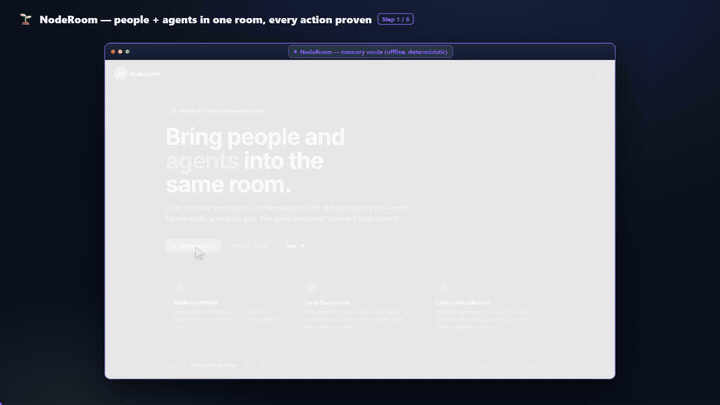
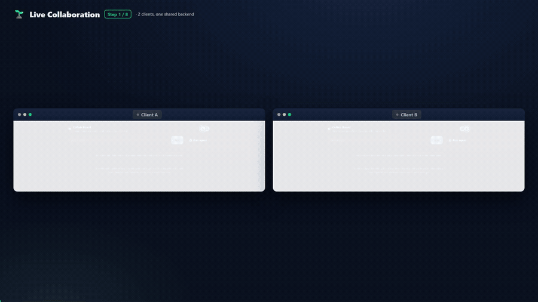
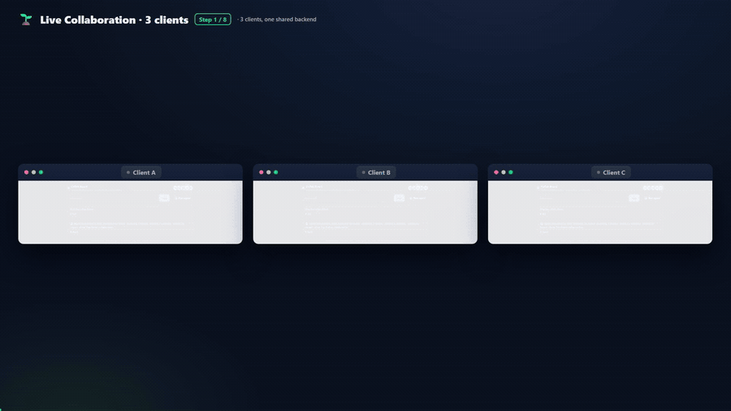
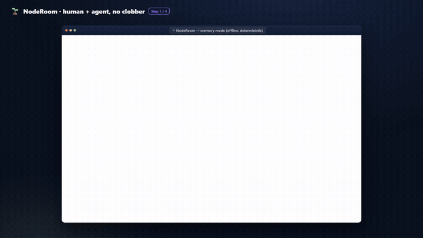
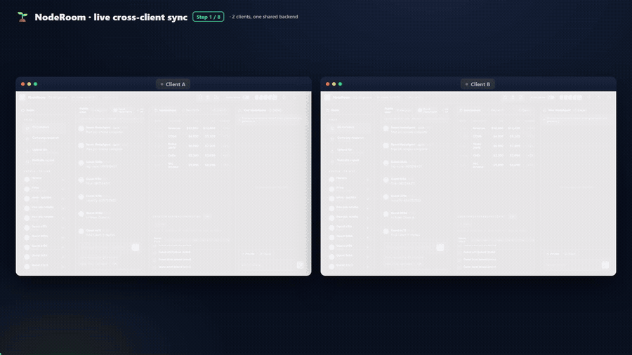
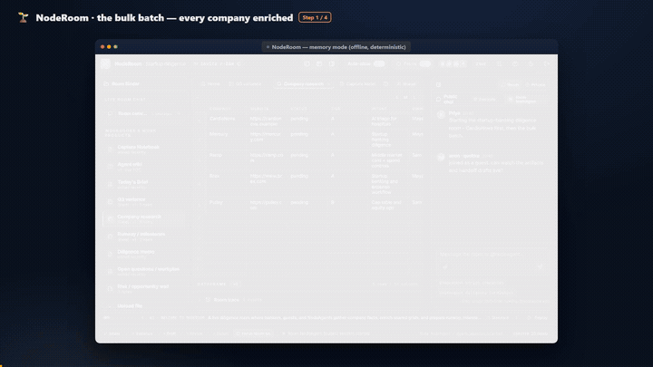
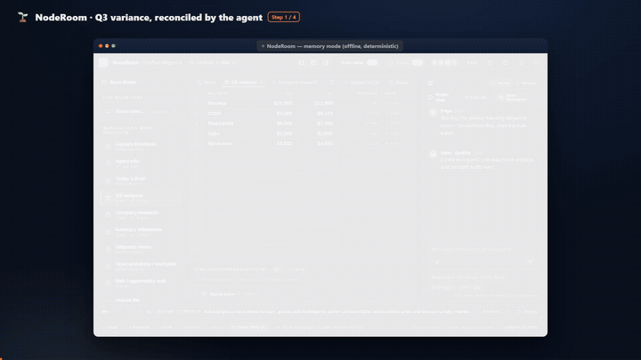

<div align="center">

# 🎬 feature-walkthrough-gif

### Turn any web feature into a polished, **annotated walkthrough GIF**.

Every UI state · an animated cursor that **glides to each click** (with a ripple) · a **zoom‑to‑focus camera** · the **loading/streaming captured live** (spinner spinning, results coming in) · step captions · a progress bar.
Not a single final‑state "hero shot" — the viewer follows the *whole flow*.

[](LICENSE)




<sub>↑ produced by this tool — every state, the click, the agent's work, and the proof.</sub>

</div>

---

## Why

Most README/demo GIFs are **hero shots** — they show the *final* screen, so a viewer
can't tell *where the user clicked*, what the empty state looked like, or how the
result was reached. This tool generates true **walkthroughs**: clean per‑state frames,
an overlaid cursor that eases to each target and ripples on click, an Arcade‑style
camera that zooms to the action (and pulls back to frame the result), a step caption,
and a progress bar.

It's fully **scripted + reproducible** (the spec is a checked‑in "tape"), so the GIFs
double as a regenerable integration smoke‑test of your UI.

## How it works — a 4‑stage pipeline

```
walkthrough.specs.mjs     1. SPEC    ordered cap/act ops per feature
        │
        ▼
node walkthrough.mjs       2. CAPTURE Playwright drives your app, screenshots a CLEAN
                                      frame at each state + records the pointer target
   →  public/wt/<id>/*.png            + writes src/walkthrough.data.js
        │
        ▼
npx remotion render        3. RENDER  Remotion overlays the animated cursor + ripple +
   src/index.js WT-<id>               zoom/pan camera + caption + progress  →  mp4
        │
        ▼
ffmpeg (two‑pass palette)  4. GIF     stats_mode=diff + lanczos + bayer + diff_mode
   →  assets/feature-*.gif            =rectangle  →  clean, small, looping GIF
```

## Quick start

**Prerequisites:** Node 18+, `ffmpeg` on PATH, and your app running locally in a clean
(no‑auth / demo) state.

```bash
git clone https://github.com/HomenShum/feature-walkthrough-gif
cd feature-walkthrough-gif
npm install
npx playwright install chromium

# Render the bundled worked example (ships with captured frames — no app needed):
npm run render:example                 # -> out/example.mp4
ffmpeg -y -i out/example.mp4 -vf "fps=15,scale=720:-1:flags=lanczos,split[s0][s1];[s0]palettegen=max_colors=128:stats_mode=diff[p];[s1][p]paletteuse=dither=bayer:bayer_scale=3:diff_mode=rectangle" -loop 0 example.gif
```

The bundled example is a [solo-founder 3D proof-run app](https://github.com/HomenShum/solo-founder-agent-builder)
(builder console → generate a scroll-driven 3D product story → customer-facing landing
page → internal proof report with gates) — the captured frames +
`src/walkthrough.data.js` are included so it renders immediately.

## Make it your own

1. **Write a spec.** Edit `walkthrough.specs.mjs` — each feature is an ordered list of ops:
   ```js
   {
     id: "Search", title: "Instant Search", accent: "#10b981", tab: "Search",
     steps: [
       { cap: "Type a query",        cursor: "input" },
       { act: "fill", sel: "input", value: "invoices", commit: "Enter" },
       { cap: "Hit search",          cursor: "btn:Search", click: true },
       { act: "click", sel: "btn:Search" },
       { act: "sleep", ms: 1200 },
       { cap: "Results, instantly",  hold: 90 },               // captures the result
       { act: "waitText", value: "results" },
       { act: "scrollEl", sel: "df", last: true },             // center the result widget
       { cap: "Filter to what matters", hold: 100 },
     ],
   }
   ```
   - `cap` = **capture** this state. `cursor` = where the pointer glides (`click:true` ripples there). `hold` = frames to dwell.
   - `cap` + `burst: { ms, every }` = **capture the loading/streaming motion** — a rapid frame sequence (spinner spinning, status updating, results streaming in), played back as real motion instead of a frozen snapshot. Put it right after the click that starts the work.
   - `act` = **advance** the UI: `fill | click | upload | sleep | waitText | notRunning | scrollEl | scrollText | scrollLastChat | scrollTop | scrollY`.
   - Selector shorthand: `textarea` · `input` · `file` · `drop` · `chat` · `btn:<name regex>` · `aria:<label>` · `aria^:<prefix>` · `df`/`iframe`/`metric` (for `scrollEl`) · any CSS.
2. **Capture + render:** start your app's clean harness, then
   `node walkthrough.mjs` → `npx remotion render src/index.js WT-<id> out/<id>.mp4` → ffmpeg.
3. **Embed** the GIF under each feature's README heading.

> Built and battle‑tested against **Streamlit** (see the capture lessons in
> [`SKILL.md`](SKILL.md): scope locators to the active tab panel, await upload
> registration, data‑grids are canvas, capture the loading state on purpose), but the
> spec/selector model works for any browser UI. See
> [`walkthrough.solo-founder.mjs`](walkthrough.solo-founder.mjs) for a non-Streamlit
> adaptation (React SPA with hash routes — simpler selector model, `goto` action for
> URL-based navigation).

## Design principles (researched)

Distilled from Arcade, Supademo, HowdyGo, CleanShot, Rekort, Mux, ubitux's
*High‑quality GIF with FFmpeg*, GIPHY, and WCAG — see [`SKILL.md`](SKILL.md) for the
full list with sources:

- **Two‑pass palette is mandatory** (`stats_mode=diff` + `lanczos` + `bayer` +
  `diff_mode=rectangle`) — the difference between a banded mess and a clean demo, and it shrinks the file.
- **Zoom/pan to focus**, eased, with a pre‑move delay — click‑triggered zoom (~1.3–1.6×) beats highlight‑only for comprehension and makes small text legible.
- **Cursor at ~1.5–2× OS size + a click ripple** — a real cursor is invisible after downscaling; the ripple is the silent stand‑in for a click sound.
- **Show every state, including loading** — never cut an action straight to a finished result.
- **Pace from the caption** (no narration), write outcome statements ("Filter to overdue invoices", not "Click Filter").
- **3–10 s, one feature, seamless loop**, ~640–800 px wide. Ship MP4 + GIF; GitHub auto‑embeds a bare MP4 URL.

## Live collaboration (multi-pane)

Single-cursor capture can't show what makes a *collaborative* app special — a change
in one client appearing **live** in another. So the tool also has a **multi-pane
mode**: it drives N browser contexts (separate "users") and renders them
**side-by-side**, cursor on the acting client, with a `burst` over the moment the
change propagates.



The composition scales to **N panes** — same spec model, one window per client:

<details><summary><b>3-client variant</b> (<code>WTC-LiveSync3</code> — one add, two collaborators react)</summary>



</details>

### Room OS V0 -> V3 live production comparison

This repo now includes a four-pane production walkthrough for
[Room OS](https://github.com/HomenShum/local-collab-mvp). The capture script opens
four fresh rooms on [room-os-live.vercel.app](https://room-os-live.vercel.app), selects
V0/V1/V2/V3, starts the same live model task, sends the same mid-run interrupt, opens
the internal state layer, and renders the result as one educational comparison. The
storyboard alternates all-version overview shots with focused transcript/state shots
so the human steer, agent outputs, `roomState`, and V3 worker stats stay readable.


What the clip teaches:

- **V0 Failure**: raw transcript coordination can speak, but it cannot prove durable progress.
- **V1 Room State**: the reducer owns floor, turn, count, done, and loop-risk state.
- **V2 Work Room**: user interrupts become typed intent, so retargeting is durable.
- **V3 Agent OS**: the room adds goals, workers, artifacts, policy, expected cost, observed latency, and trace payloads.

Reproduce the clip:

```bash
node walkthrough.roomos.mjs
npx remotion render src/roomos-index.js WTG-RoomOSV0123 out/room-os-v0-v1-v2-v3.mp4 --concurrency=2
ffmpeg -y -i out/room-os-v0-v1-v2-v3.mp4 -vf "fps=10,scale=1280:-1:flags=lanczos,split[s0][s1];[s0]palettegen=max_colors=128:stats_mode=diff[p];[s1][p]paletteuse=dither=bayer:bayer_scale=3:diff_mode=rectangle" -loop 0 assets/room-os-v0-v1-v2-v3.gif
```

### Visual Labs full-flow walkthrough

Visual Labs is a single-pane example of an agentic creative workflow: trend-to-prompt,
prompt refinement, image render, dry-run publishing, analytics pull, and a Fastino-ready
export loop. It is useful as the opposite shape from Room OS: one browser, many states,
with burst captures over the moments where agent/tool output streams back into the UI.


Reproduce the clip:

```bash
VISUAL_URL=http://127.0.0.1:3000 node walkthrough.visual.mjs
npx remotion render src/index.js WT-VisualLabsFlow out/visual-labs-full-flow.mp4 --concurrency=2
```

Ships with a **worked example** (the live-collab counterpart to the single-pane one):
- **[`examples/collab-demo/`](examples/collab-demo/)** — a runnable, **zero-dependency**
  local app (Node SSE server + vanilla JS) that faithfully reproduces the Convex
  reactive pattern: optimistic paint → server commit → broadcast to *all* clients →
  atomic temp→real swap; presence; a server-led agent that **streams to every client**.
  Runs with no cloud login, so the GIF reproduces anywhere.
- **[`examples/convex-reference/`](examples/convex-reference/)** — the **real Convex +
  React** implementation of the same app (`useQuery` reactive subscriptions,
  `useMutation().withOptimisticUpdate`, `ctx.scheduler` + `internalMutation` for the
  streamed agent) — the production reference, mapped 1:1 to the local demo.

Reproduce it:
```bash
node examples/collab-demo/server.mjs        # local demo on :8930 (no install, no login)
node walkthrough.collab.mjs                 # multi-pane capture: Client A + Client B
npx remotion render src/index.js WTC-LiveSync out/collab.mp4
# then the same two-pass ffmpeg palette → assets/feature-collab.gif
```
Panes + steps live in `walkthrough.collab.specs.mjs`; the 2-up renderer is
`src/Walkthrough2up.jsx`. See **[`STACK_GUIDELINES.md`](STACK_GUIDELINES.md)** for why
Convex + React demos need this and Streamlit doesn't.

## Real-world example: NodeRoom (Convex + React)

The repo also ships with captured walkthroughs of [NodeRoom](https://github.com/HomenShum/noderoom) —
a production Convex + React live-collaborative diligence room. These prove the tool works
against a real, deployed app (not just a demo harness).

<details><summary><b>NodeRoom · a shared diligence room + a NodeAgent</b> (single-pane, memory mode)</summary>



</details>

<details><summary><b>NodeRoom · live sync across two clients</b> (2-pane, deployed app)</summary>



</details>

<details><summary><b>NodeRoom · the bulk batch — every company enriched</b> (single-pane, memory mode)</summary>



</details>

<details><summary><b>NodeRoom · Q3 variance, reconciled by the agent</b> (single-pane, memory mode)</summary>



</details>

Specs: `walkthrough.noderoom.specs.mjs`. Capture: `node walkthrough.collab.mjs` (the NodeRoom
specs are imported into the collab specs). Render: `npx remotion render src/index.js WTC-NRsolo`
/ `WTC-NRsync` / `WTC-NRfresh` / `WTC-NRdeepDive`.

## Designing for specific stacks

What's worth *showing* in a walkthrough differs by architecture — a single-cursor
capture flatters a single-user **Streamlit** data app but misses what makes a
live-collaborative **Convex + React** app special (a change in one client appearing
*live* in another). See **[`STACK_GUIDELINES.md`](STACK_GUIDELINES.md)** for per-stack
guidance — which SDK primitives produce capturable motion, single-pane vs multi-pane
capture, and what to `burst` — for Streamlit, Convex+React, and Next.js+SQL on Vercel,
grounded in the latest Streamlit & Convex docs.

## Use as a Claude Code skill

This repo *is* a [Claude Code](https://docs.claude.com/en/docs/claude-code) skill —
drop it in `.claude/skills/` (or reference [`SKILL.md`](SKILL.md)) and Claude can drive
the whole pipeline: write a spec, capture, render, and embed the GIFs for you.

## License

[MIT](LICENSE) © Homen Shum
